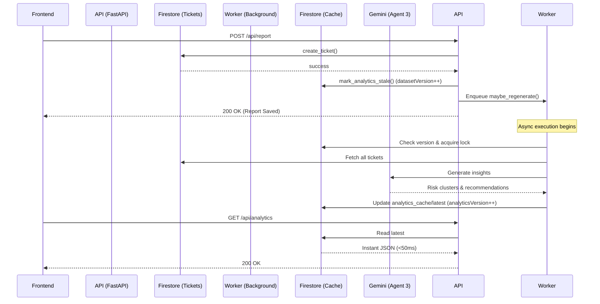

# CivicFlow System Architecture

This document serves as the definitive reference for the **CivicFlow** technical architecture. It covers the end-to-end flow from the citizen reporting interfaces through the backend AI agent pipeline and into the event-driven analytics caching layer.

---

## 1. High-Level System Overview

CivicFlow is built on a modern, serverless, and highly scalable stack designed to process unstructured citizen reports using AI vision and workflow automation.

The core flow is:
1. Citizen uploads a photo and location via the web interface.
2. The FastAPI backend processes the request and calls a pipeline of Gemini AI Agents.
3. The AI extracts the issue type, determines severity, and routes it to the correct municipal department.
4. The ticket is saved to Firestore.
5. Ticket mutations automatically trigger an asynchronous background worker to regenerate predictive analytics without blocking user requests.

```mermaid
flowchart TD
    A[Citizen Dashboard (React)] -->|POST /api/report (Image + Location)| B(FastAPI Backend)
    B -->|Base64 Image| C[Agent 1: Assessor]
    C -->|Structured JSON| D[Agent 2: Router]
    D -->|Ticket Document| E[(Firestore tickets)]
    E -->|Triggers Stale Flag| F[Analytics Background Worker]
    F -->|Batch Analysis| G[Agent 3: Analyst]
    G -->|Updates| H[(Firestore analytics_cache)]
    H -->|GET /api/analytics (<50ms)| A
```

---

## 2. Component Architecture

### Frontend Architecture
- **Framework**: React.js (Vite)
- **Styling**: Tailwind CSS
- **Mapping**: Leaflet.js / OpenStreetMap
- **State Management**: React Hooks + Axios for API communication.
- **Hosting**: Cloudflare Pages (Static Edge CDN).

### Backend Architecture
- **Framework**: FastAPI (Python 3.10+)
- **Server**: Uvicorn (ASGI)
- **File Processing**: Zero-cost in-memory multipart processing (Base64 compression to avoid temporary disk writes).
- **Hosting**: Google Cloud Run (Containerized, scales to zero).

### AI Engine
- **Provider**: Google AI Studio
- **Model**: Gemini 2.5 Flash
- **Pipeline**: Sequential multi-agent handoffs using strict Pydantic structured outputs.

---

## 3. The Gemini Multi-Agent Pipeline

CivicFlow replaces traditional dropdown forms with three specialized AI agents.

### Agent 1: The Assessor (Vision AI)
- **Input**: Base64 encoded image and optional user description.
- **Action**: Uses multimodal vision to classify the anomaly (e.g., "Pothole", "Fallen Tree") and assigns a visual severity score.
- **Output**: Structured JSON containing category, severity, and context.

### Agent 2: The Router (Workflow Automation)
- **Input**: The JSON output from the Assessor, plus geolocation coordinates.
- **Action**: Determines the specific municipal department responsible for the issue and drafts a formal maintenance ticket with a priority level.
- **Output**: Final structured Ticket JSON ready for database insertion.

### Agent 3: The Analyst (Event-Driven Predictive Analytics)
- **Input**: Aggregated ticket data from Firestore.
- **Action**: Clusters historical data, predicts risk hotspots, and generates preventative infrastructure recommendations.

---

## 4. Analytics Cache Architecture

A major architectural update migrated Agent 3 from a synchronous, per-request execution model to a highly performant **Event-Driven Cached Architecture**.

**Why?**
Previously, every time a user loaded the dashboard, the backend fetched all tickets, sent them to Gemini, and waited for a response. This caused 5-10 second loading times and massive token waste.

**The Solution:**


### Versioning and Optimistic Locking
- **`datasetVersion`**: Incremented every time a ticket is created or modified.
- **`analyticsVersion`**: Tracks the version of data the cache was built against.
- When `datasetVersion > analyticsVersion`, the data is stale. The background worker uses a Firestore transaction to acquire an optimistic lock (`generationInProgress = true`) to prevent concurrent workers from running the same expensive LLM task.

---

## 5. Deployment Architecture

- **Google Cloud Run**: The Dockerized FastAPI backend is deployed here, automatically scaling up during high reporting events (e.g., a severe storm) and scaling to zero to save costs.
- **Firebase Hosting**: Serves the Vite React frontend via a global CDN.
- **Firestore**: Serverless NoSQL database managing ticket states and analytics caches.

---

## 6. Future Architecture (Mobile)

As CivicFlow expands, a native mobile application is planned:
- **Framework**: Flutter
- **Integration**: The Flutter app will communicate directly with the exact same FastAPI endpoints (`POST /api/report`, `GET /api/tickets`) as the web frontend, ensuring cross-platform consistency.
- **Offline Capabilities**: Using SQLite/Hive to queue reports locally if the user is out of cell service, syncing to FastAPI when connectivity returns.

---

## 7. Security & Scalability Overview

- **Cloudflare Pages**: Serves the Vite React frontend via a global CDN.
- **Google Cloud Run**: Runs the FastAPI backend in a serverless Docker container, auto-scaling to zero when idle to minimize costs.
- **CORS**: FastAPI strictly enforces Cross-Origin Resource Sharing, allowing requests only from the deployed Cloudflare Pages domain (and localhost for dev).
- **Stateless Backend**: The FastAPI servers store no local state, allowing Cloud Run to instantly spin up hundreds of instances safely.
- **Token Efficiency**: By caching Agent 3 analytics, Gemini API costs are reduced by over 95%, as inferences only occur when ticket data physically changes, rather than on every page load.
