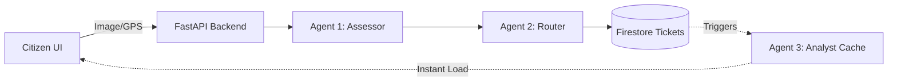

# CivicFlow 🌐🏙️
> **Autonomous Municipal Triage System**

CivicFlow is an interactive, open-source platform that empowers citizens to identify, report, and track hyperlocal community issues (such as potholes, water leakages, and broken streetlights) while utilizing an AI multi-agent system to autonomously categorize, route, and analyze reports for municipal action.

---

## 📖 Table of Contents
- [Project Overview](#project-overview)
- [Features](#features)
- [Technology Stack](#technology-stack)
- [System Architecture](#system-architecture)
- [AI Multi-Agent Workflow](#ai-multi-agent-workflow)
- [Analytics Cache Architecture](#analytics-cache-architecture)
- [API Overview](#api-overview)
- [Project Structure](#project-structure)
- [Installation & Setup](#installation--setup)
- [Deployment](#deployment)
- [Performance Optimizations](#performance-optimizations)
- [Roadmap](#roadmap)
- [Contributing](#contributing)
- [License](#license)

---

## 🎯 Project Overview
Traditional municipal reporting systems rely on tedious drop-down menus and manual triage by city workers. CivicFlow revolutionizes this by allowing a citizen to simply upload a photo. The backend AI **Assessor** and **Router** agents instantly classify the anomaly and draft a prioritized ticket for the correct municipal department. 

## ✨ Features
- **Zero-Friction Reporting**: Upload an image and location; the AI handles the rest.
- **Live Community Map**: View, track, and upvote active issues on a real-time OpenStreetMap dashboard.
- **Multi-Agent Pipeline**: Specialized LLM agents handle distinct tasks (Vision Assessment, Department Routing, Predictive Analytics).
- **Predictive AI Insights**: Generates automated risk clusters and preventative maintenance recommendations.
- **High-Performance Caching**: Event-driven analytics cache ensures dashboard loading times under 50ms.

---

## 🛠️ Technology Stack
- **Frontend**: React (Vite), Tailwind CSS, Framer Motion, Leaflet.js
- **Mobile (Coming Soon)**: Flutter
- **Backend**: FastAPI (Python)
- **AI Engine**: Google AI Studio (Gemini 2.5 Flash)
- **Database**: Firebase Firestore (NoSQL)
- **Deployment**: Google Cloud Run, Cloudflare Pages, Docker

---

## 🏗️ System Architecture
The platform utilizes a highly scalable, serverless architecture.


> 📚 **Deep Dive**: See [Doc/Architecture.md](Doc/Architecture.md) for detailed component diagrams and trade-off analysis.

---

## 🧠 AI Multi-Agent Workflow
CivicFlow replaces forms with sequential AI intelligence:
1. **Agent 1 (The Assessor)**: Vision AI examines the image to classify the issue and severity.
2. **Agent 2 (The Router)**: Takes the Assessor's JSON and determines the target municipal department and priority.
3. **Agent 3 (The Analyst)**: Scans all Firestore reports to identify patterns and predict hotspots in the background.

> 📚 **Deep Dive**: See [Doc/AI_Agents.md](Doc/AI_Agents.md) for prompt strategies and schema validations.

---

## ⚡ Analytics Cache Architecture
CivicFlow utilizes an **Event-Driven Cached Architecture** for analytics generation. 
Instead of hitting the Gemini API on every dashboard load, ticket mutations asynchronously trigger a background worker. This worker updates the `analytics_cache` in Firestore. 
The dashboard reads this cache instantly (<50ms).

> 📚 **Deep Dive**: See [Doc/Performance.md](Doc/Performance.md) for latency benchmarks and [Doc/Database.md](Doc/Database.md) for versioning strategy.

---

## 🔌 API Overview
CivicFlow provides a clean REST API. Core endpoints include:
- `POST /api/report` - Submit issue & trigger Agents 1 & 2.
- `GET /api/tickets` - Fetch all community tickets.
- `PATCH /api/tickets/{id}/verify` - Community upvoting.
- `GET /api/analytics` - Fetch cached predictive insights.
- `POST /api/analytics/regenerate` - Admin cache reset.

> 📚 **Deep Dive**: See [Doc/API.md](Doc/API.md) for full request/response schemas.

---

## 📂 Project Structure
```text
civicflow/
├── frontend/             # React (Vite) Application
├── frontend-mobile/      # Flutter Application (Upcoming)
├── backend/              # FastAPI Application & AI Agents
├── flutter-sdk/          # Self-contained Flutter environment tools
├── Doc/                  # Comprehensive Technical Documentation
├── CHANGELOG.md          # Release History
├── ROADMAP.md            # Long-term feature planning
└── README.md             # This document
```

---

## 🚀 Installation & Setup

### 1. Backend Setup
1. Navigate to the backend directory: `cd backend`
2. Create virtual environment: `python -m venv venv` and activate it.
3. Install dependencies: `pip install -r requirements.txt`
4. Configure `.env` with `GEMINI_API_KEY` and Firebase credentials.
5. Run server: `uvicorn app.main:app --reload`

### 2. Frontend Setup
1. Navigate to the frontend directory: `cd frontend`
2. Install dependencies: `npm install`
3. Start Vite dev server: `npm run dev`

### 3. Flutter (Coming Soon)
A mobile application is currently in active development under the `frontend-mobile/` directory utilizing the isolated `flutter-sdk/` environment.

---

## ☁️ Deployment
- **Backend (Google Cloud Run)**: Built via the included `Dockerfile` and deployed as a serverless container.
- **Frontend (Cloudflare Pages)**: Built via `npm run build` and deployed using the Cloudflare Pages CI/CD pipeline or Wrangler CLI.

---

## 📈 Performance Optimizations
The migration to an Event-Driven Analytics Cache resulted in:
- **99% reduction** in dashboard load times (10s → 50ms).
- **90%+ reduction** in wasted LLM token consumption.

---

## 🗺️ Roadmap
See [ROADMAP.md](ROADMAP.md) for details on upcoming features, including GIS Heatmaps, Authentication, ML Risk Scoring, and the Flutter mobile app.

---

## 🤝 Contributing
Contributions are welcome! Please ensure you read the architectural guidelines in the `Doc/` folder before submitting Pull Requests. Ensure any modifications to the AI agents respect the Pydantic schemas.

---

## 📄 License
This project is open-source and available under the MIT License.