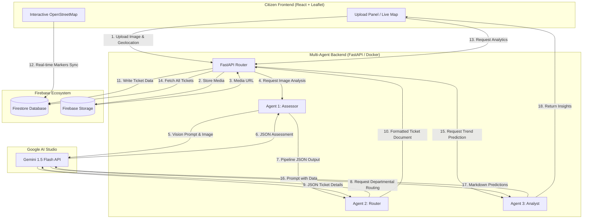

# CivicFlow Architecture

This document describes the design, components, and data flow of the CivicFlow system.

## 🧱 Component Diagrams

---

## 🚦 End-to-End Data Flow

### 1. Issue Reporting Pipeline
1. **Reporting Input**: A citizen opens the web application, which requests browser-level GPS permissions to capture geographical coordinates (Latitude & Longitude).
2. **Media Capture**: The user captures or selects an image/video of the issue, adds an optional text description, and hits the "Submit" button.
3. **Multipart Form POST**: The client submits a multipart form request containing coordinates, text description, and raw image bytes to `/api/report`.
4. **Cloud Object Upload**: The FastAPI server receives the upload and transfers the image to **Firebase Storage** (under `issue_images/`). It retrieves the public URL for the newly stored image.
5. **Agent 1 (The Assessor)**: The backend prompts Gemini 1.5 Flash using the image URL and specific assessment system instructions. Gemini returns a validated JSON string outlining classification and severity.
6. **Agent 2 (The Router)**: The backend routes Agent 1's JSON evaluation into Agent 2. Gemini maps the evaluation to a specific municipal department (e.g., Water and Sewerage Board), constructs a ticket title, and flags standard tags.
7. **Persistence**: The FastAPI backend merges the user description, coordinates, image URL, and Agent 2's departmental ticket details, storing it as a unified document in the **Firebase Firestore** collection `tickets`.
8. **Real-time Map Sync**: The citizen map dashboard automatically syncs with the `tickets` collection, rendering the new issue marker instantly.

### 2. Analytics Generation Pipeline
1. **Analytics View Request**: An administrator or user clicks on the "Analytics" tab, firing a `GET` request to `/api/analytics`.
2. **Firestore Read**: FastAPI reads all existing documents in the `tickets` collection.
3. **Agent 3 (The Analyst)**: The backend aggregates the raw ticket list (category, coordinates, department, date) and feeds it to Gemini 1.5 Flash. The agent processes the clusters to predict infrastructure failures (e.g., aging sewer pipelines in a specific zone) and returns structured markdown insights.
4. **Display**: The insights are served to the frontend and rendered in a clean cards component.
